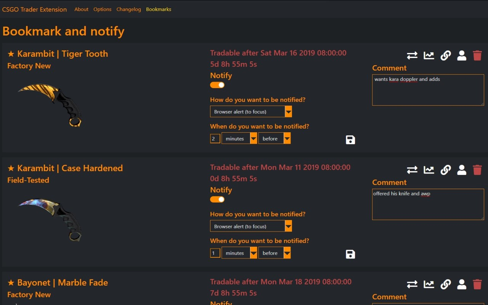
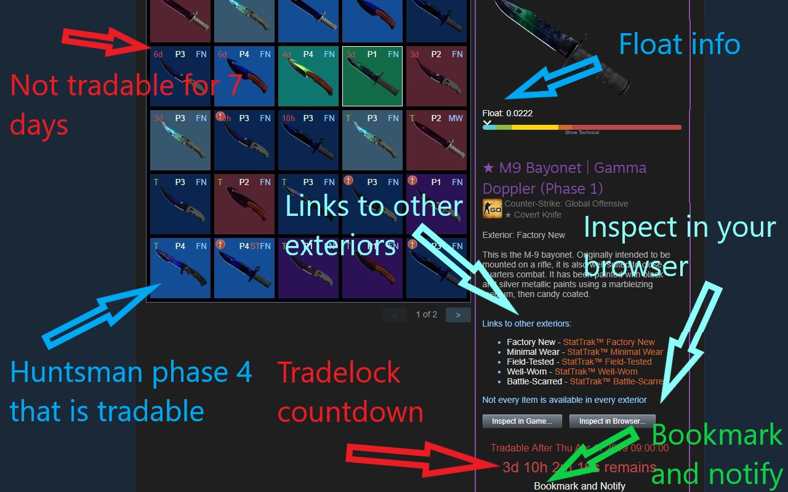

CSGO Trader Browser Extension
==============

CSGO Trader is a browser extension for Chrome and Firefox that is designed to help with CS:GO trading.
I started by adding functionality that Steam Inventory Helper lacked, but it already has SIH's most important features and much more.

An incomplete list of current features:
--------------
- Pricing info in inventories and trade offers
- Total inventory value, trade offer value
- Show profit for incoming trade offers, order by most profitable first
- "Inspect in Browser..." button on market, inventories and trade offers
- Item mass listing/selling
- Shows when an item's trade lock will expire and adds a countdown
- Shows floats and other technical info like paint index, paint seed, pattern index in inventories, offers and on the market
- Order by float value on market pages, show more than the default 10 listings on the market
- Doppler phases, fade percentages, marble fade patterns (fire and ice, blue tip, red tip, etc.)
- Shows exterior on each item and adds links to other version to inventory and market pages
- NSFW filter mode to avoid showing anime boobs to your colleagues
- Bookmark an item and get a notification when it is ready to trade
- Real chat status on profiles (away, busy, snooze instead of just online)
- Colorful inventories, changes each items' background based on its rarity
- Scammers are market on their profile and in trade offers (if they are SteamRep banned)
- CSGOLounge.com auto-bumping, make your trades more popular by keeping them on top
- CSGOTraders.net auto-bumping, make your trades more popular by keeping them on top
- Add or remove similar items from a trade, add whole page, add all similar items
- Pricing providers: CSGO Trader, CSGOBACKPACK, CS.MONEY, Bitskins, LOOT.FARM, CSGO.TM
- See the original currency and price an item was listed on the market
- "Starting at" price info and sales volume info in everyone's inventory
- Instant accept trade offer and decline trade offer buttons on the incoming trade offers page
- Float rank (like 5th best in existence) data from csgofloat
- Currency converter, percentage calculator in the extension popup.
- Report known spam and scam comments automatically (like fake giveaway comments on profiles)
- Reply to comments by tagging the other user's name
- Generate a list of inventory items (to post advertisements, etc.)
- +rep button on profiles to post your reputation message after trade
- Check the value of multiple items in an inventory by selecting them
- Sort inventories and trade offers by price, tradability, name or position
- Set default sorting mode for inventories and trade offers
- All inventory items are loaded automatically, no need to wait for loading when searching or switching pages
- Sticker wear (condition percentage) in inventories and on the market
- Copy a user's permanent profile link (scammers often change their links automatically)
- Duplicate items count in inventories
- Other small features, automations, conveniences

Feel free to contribute (with code, graphics, translations or even with ideas)

You can follow the development by checking the <a target="_blank" href="https://github.com/gergelyszabo94/csgo-trader-extension/projects/1">Kanban Board</a>

I have tagged some open issues as good-fist-issue. I am glad to give pointers and assistance to anyone who wants to contribute!

Install
--------------
Get it from your browser's marketplace:

 

Or to install the in-development ("nightly") version, download the code and <a target="_blank" href="https://developer.chrome.com/extensions/getstarted">follow these instructions</a> (from after "Create a Manifest")

Feature Showcase
--------------

 

 

 

 

